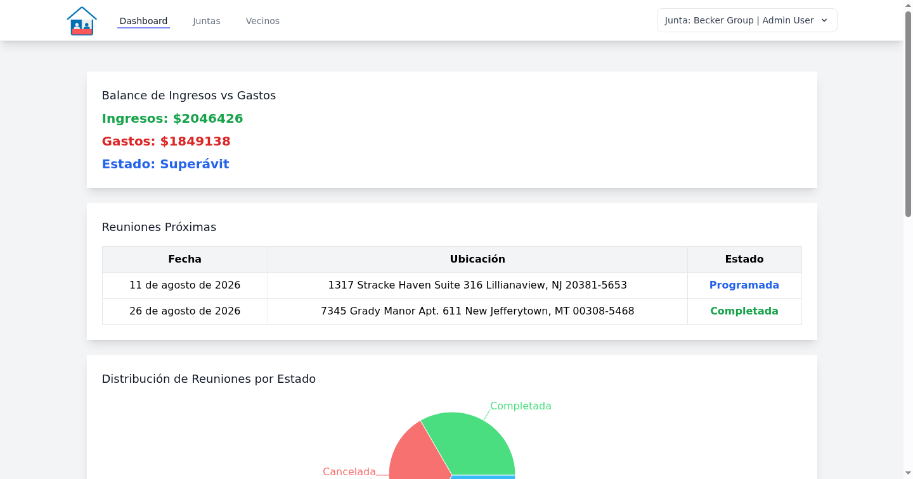
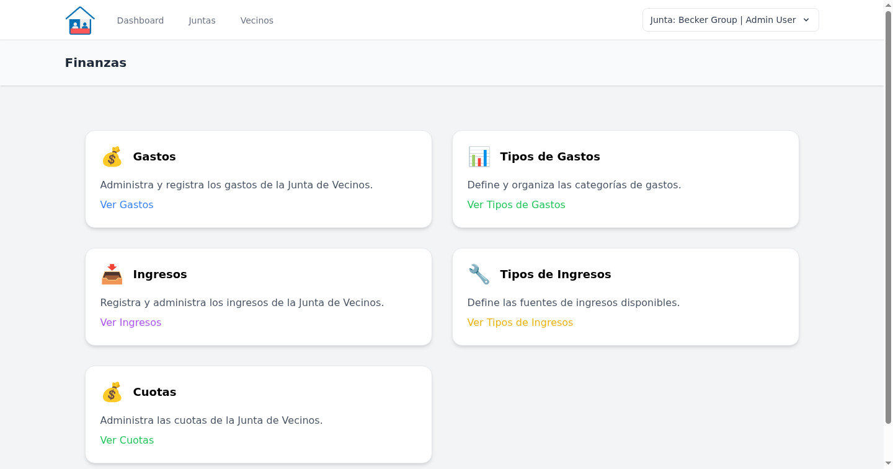
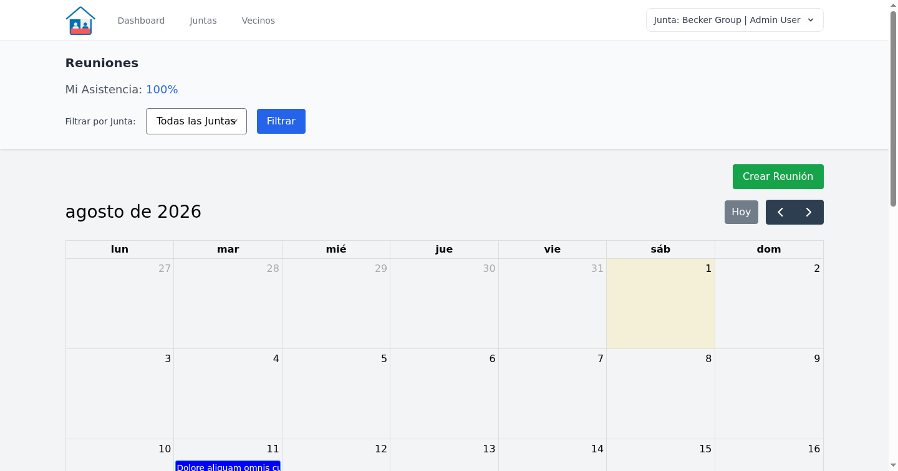
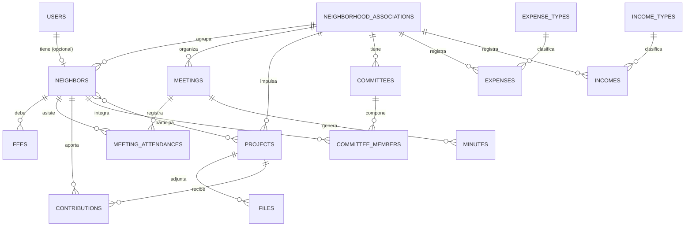

# 🏘️ Community Platform - Junta Transparente

[](https://laravel.com)
[](https://reactjs.org)
[](https://tailwindcss.com)
[](https://inertiajs.com)
[](https://junta-app-production.up.railway.app)

> 🔄 **Revival de un proyecto de título universitario.** Este repo parte de
> [fit-dran/juntatransparente](https://github.com/fit-dran/juntatransparente) (2024) y fue
> saneado y llevado a un estándar de ingeniería productivo: se corrigieron bugs reales del
> modelo de datos, se agregaron Policies de autorización multi-tenant, tests automatizados
> (Pest + Dusk/E2E), CI en GitHub Actions, Docker y despliegue en Railway. Ver
> [Licencia y créditos](#-licencia) para el detalle de la atribución.

## 📖 Descripción

**Community Platform** es una aplicación web moderna desarrollada con Laravel y React para la gestión integral de juntas de vecinos. El sistema facilita la administración, promueve la transparencia y fomenta la participación ciudadana mediante herramientas digitales intuitivas.

### 🎯 Propósito
Digitalizar y modernizar la gestión de comunidades vecinales, proporcionando transparencia financiera, comunicación efectiva y administración eficiente de recursos comunitarios.

## ✨ Características Principales

### 👥 **Gestión de Usuarios Multi-Rol**
El sistema define 3 roles (`admin`, `board_member`, `resident`):
- **Administrador** (`admin`): Control total del sistema y de todas las juntas de vecinos
- **Directiva** (`board_member`): Gestión completa de su propia junta vecinal (vecinos, proyectos, reuniones, finanzas, comités)
- **Vecino** (`resident`): Consulta de información y participación en proyectos/reuniones de su junta

### 📊 **Dashboard Interactivo**
- Métricas en tiempo real de finanzas y participación
- Gráficos de ingresos, gastos y proyectos
- Indicadores de actividad de la comunidad

### 💰 **Gestión Financiera Transparente**
- Registro detallado de ingresos y gastos
- Categorización automática de transacciones
- Reportes financieros exportables (PDF/Excel)
- Historial de cuotas y pagos de vecinos

### 🏗️ **Gestión de Proyectos Comunitarios**
- Seguimiento de proyectos de mejoramiento
- Estados de avance en tiempo real
- Documentación y archivos adjuntos
- Presupuestos y control de gastos por proyecto

### 📅 **Sistema de Reuniones**
- Calendario interactivo de reuniones
- Generación automática de actas
- Control de asistencia digital
- Notificaciones automáticas

### 📋 **Gestión de Comités**
- Organización de comités especializados
- Asignación de responsabilidades
- Seguimiento de tareas y objetivos

## 🛠️ Stack Tecnológico

### Backend
- **Framework**: Laravel 11.x
- **Base de Datos**: MySQL 8.4+
- **Autenticación**: Laravel Sanctum
- **API**: RESTful con Inertia.js

### Frontend
- **Framework**: React 18.x
- **Build Tool**: Vite
- **Styling**: TailwindCSS 3.x
- **SPA Framework**: Inertia.js
- **Iconos**: Heroicons

### Herramientas de Desarrollo
- **Testing**: Pest (unit/feature) + Laravel Dusk (E2E con ChromeDriver/Selenium WebDriver)
- **Code Quality**: Laravel Pint
- **CI/CD**: GitHub Actions (lint + Pest + Dusk en cada push/PR, ver `.github/workflows/tests.yml`)
- **Contenedores**: Docker Compose (MySQL 8.4 + phpMyAdmin) para desarrollo local
- **Package Manager**: Composer, NPM

## 🚀 Demo en Vivo

🔗 **Ver Demo**: [junta-app-production.up.railway.app](https://junta-app-production.up.railway.app)

> La base de datos se resetea automáticamente cada 6 horas (ver [Reseed automático](#-reseed-automático-la-demo-es-pública-y-con-login-real)), así que si encuentras la data "rara" ya se va a limpiar sola.

### 👤 Credenciales de Prueba

| Rol | Email | Contraseña | Permisos |
|-----|-------|------------|----------|
| **Administrador** | `admin@example.com` | `password` | Acceso completo al sistema |
| **Directiva** | `board_member@example.com` | `password` | Gestión completa de su junta vecinal |
| **Vecino** | `vecino@example.com` | `password` | Consulta y participación en su junta |

## 💻 Requisitos del Sistema

- **PHP** >= 8.2.12
- **Composer** >= 2.8.3
- **MySQL** >= 8.4
- **Node.js (LTS)** >= 22.12.0
- **Git** >= 2.30

## ⚡ Instalación y Configuración

### 🔧 Configuración Local

1. **Clonar el repositorio**
   ```bash
   git clone https://github.com/Astt3r/CommunityPlatform.git
   cd CommunityPlatform
   ```

2. **Levantar MySQL con Docker Compose**
   ```bash
   docker compose up -d
   ```
   Esto crea la base `community_platform` en `127.0.0.1:3306` (usuario `junta` /
   contraseña `junta`) y un phpMyAdmin opcional en `http://localhost:8081`.

3. **Instalar dependencias**
   ```bash
   # Dependencias PHP
   composer install
   
   # Dependencias JavaScript
   npm install
   ```

4. **Configurar entorno**
   ```bash
   # Copiar archivo de configuración (ya apunta al MySQL de Docker)
   cp .env.example .env
   
   # Generar clave de aplicación
   php artisan key:generate
   ```

5. **Migrar y poblar base de datos**
   ```bash
   # Crear tablas y datos de prueba
   php artisan migrate --seed
   
   # Solo migrar (sin datos de prueba)
   php artisan migrate
   ```

6. **Iniciar servidores de desarrollo**
   ```bash
   # Terminal 1: Servidor Laravel
   php artisan serve
   
   # Terminal 2: Build frontend
   npm run dev
   ```

7. **¡Listo! 🎉**
   - Aplicación: `http://localhost:8000`
   - Login con las credenciales de prueba mostradas arriba

### 🗄️ Explorar el esquema en DBeaver (sin instalar Laravel)

Si solo quieres inspeccionar el modelo de datos:

1. `docker compose up -d`
2. Conecta DBeaver a `127.0.0.1:3306`, base `community_platform`, usuario/contraseña `junta`/`junta`.
3. Ejecuta `database/sql/schema.sql` y luego `database/sql/seed.sql` (ver `database/sql/README.md`).

### 🐳 Instalación con Docker (alternativa: Laravel Sail)

```bash
# Usar Laravel Sail en vez de docker-compose.yml
./vendor/bin/sail up -d
./vendor/bin/sail artisan migrate --seed
```

## 📱 Capturas de Pantalla

### Dashboard Principal


### Gestión Financiera


### Calendario de Reuniones


## 🏗️ Arquitectura del Proyecto

```
app/
├── Http/Controllers/     # Controladores
├── Models/               # Modelos Eloquent
├── Policies/             # Autorización por junta de vecinos (tenant)
├── Exports/              # Exportadores Excel/PDF
└── Providers/            # Service Providers

resources/
├── js/                   # Componentes React
├── views/                # Plantillas Inertia + acta PDF (minutes/template.blade.php)
└── css/                  # Estilos

database/
├── migrations/           # Migraciones
├── seeders/              # Datos de prueba
├── factories/            # Factories para testing
└── sql/                  # schema.sql + seed.sql listos para DBeaver

tests/
├── Feature/               # Pest (incluye Feature/Policies)
├── Unit/                  # Pest
└── Browser/                # Laravel Dusk (E2E)

docker-compose.yml         # MySQL 8.4 + phpMyAdmin para desarrollo local
docs/erd.mmd                # Diagrama entidad-relación (Mermaid)
```

## 🗂️ Modelo de Datos

Esquema completo (todas las entidades, tipos y relaciones) — fuente en [`docs/erd.mmd`](docs/erd.mmd)
y DDL importable en DBeaver en [`database/sql/schema.sql`](database/sql/schema.sql).



*(diagrama resumido; el detalle completo de columnas está en `docs/erd.mmd`)*

## 🧪 Testing

El proyecto usa **Pest** para tests de backend (unit/feature, incluye policies de
autorización) y **Laravel Dusk** (ChromeDriver/Selenium WebDriver) para tests E2E
de los flujos principales (login por rol, CRUD de vecinos, reuniones + acta PDF,
proyectos, finanzas).

```bash
# Estilo de código
./vendor/bin/pint --test

# Tests de backend (Pest)
./vendor/bin/pest

# Tests E2E (Dusk) — requiere la app servida y ChromeDriver
php artisan dusk:chrome-driver --detect
php artisan serve &
php artisan dusk
```

Estos mismos pasos corren automáticamente en cada push/PR vía GitHub Actions
(`.github/workflows/tests.yml`).

## 📦 Deployment

### Producción
```bash
# Optimizar para producción
composer install --optimize-autoloader --no-dev
npm run build
php artisan config:cache
php artisan route:cache
php artisan view:cache
```

### 🚂 Railway (demo en vivo)

El repo incluye un `Dockerfile` multi-stage (build de assets con Vite + PHP 8.2)
y un `railway.json` para desplegar la app completa (incluida una base MySQL) en
[Railway](https://railway.app):

1. Crea un proyecto nuevo en Railway y elige **Deploy from GitHub repo**, apuntando a este repositorio.
2. En el mismo proyecto, agrega un servicio **MySQL** (botón "+ New" → "Database" → "MySQL").
3. En el servicio de la app (el que construye el `Dockerfile`), configura estas variables de entorno:

   | Variable | Valor |
   |---|---|
   | `APP_KEY` | genera uno localmente con `php artisan key:generate --show` y pégalo aquí |
   | `APP_ENV` | `production` |
   | `APP_DEBUG` | `false` |
   | `APP_URL` | la URL pública que Railway te asigna al servicio |
   | `DB_CONNECTION` | `mysql` |
   | `DB_HOST` | `${{MySQL.MYSQLHOST}}` |
   | `DB_PORT` | `${{MySQL.MYSQLPORT}}` |
   | `DB_DATABASE` | `${{MySQL.MYSQLDATABASE}}` |
   | `DB_USERNAME` | `${{MySQL.MYSQLUSER}}` |
   | `DB_PASSWORD` | `${{MySQL.MYSQLPASSWORD}}` |
   | `RUN_SEEDER` | `true` solo en el primer deploy (para cargar las 3 cuentas demo), luego cámbialo a `false` |

   Las referencias `${{MySQL.VARIABLE}}` son la sintaxis de Railway para leer variables de otro servicio del mismo proyecto — no necesitas copiarlas a mano.

4. Railway detecta el `Dockerfile` automáticamente y hace el deploy. El `docker/entrypoint.sh` corre las migraciones (y el seeder si `RUN_SEEDER=true`) antes de levantar el servidor.
5. Una vez arriba, actualiza el badge/link de "Demo en Vivo" al inicio de este README con la URL real.

#### 🔄 Reseed automático (la demo es pública y con login real)

Las credenciales demo (`admin@example.com` / `password`, etc.) están documentadas más abajo a propósito, para que cualquiera pueda probar la app — pero eso también significa que cualquiera puede loguearse como `admin` y modificar los datos. Para que la demo siempre se vea "limpia", se resetea sola periódicamente:

1. En el servicio de la app, agrega la variable `APP_DEMO_RESEED=true` (fuera de la demo pública, déjala en `false` o sin definir — es la guarda que evita que `demo:reset` borre una base de datos real por accidente).
2. En el mismo proyecto de Railway, crea un **segundo servicio** apuntando al mismo repo/Dockerfile ("+ New" → "GitHub Repo", mismo repositorio).
3. En ese servicio, ve a **Settings → Deploy** y:
   - Cambia el **Custom Start Command** a `php artisan demo:reset`.
   - Activa **Cron Schedule** con, por ejemplo, `0 */6 * * *` (cada 6 horas).
   - Copia las mismas variables de entorno `DB_*`/`APP_KEY` del servicio principal (o referénciales con `${{app.VARIABLE}}`).
4. Railway levanta ese servicio solo en cada horario programado, corre `migrate:fresh --seed` y se apaga — sin dejar un proceso corriendo 24/7.

### Vercel (alternativa serverless)
El proyecto también incluye configuración para Vercel en `vercel.json` (requiere una MySQL gestionada externa, ya que Vercel no aloja bases de datos).

## 👨‍💻 Desarrollo

### 🛠️ Comandos Útiles

```bash
# Linter de código
./vendor/bin/pint

# Generar migraciones
php artisan make:migration create_table_name

# Generar modelos
php artisan make:model ModelName -mfc
```

### 📋 Contribución

1. Fork del proyecto
2. Crear rama feature (`git checkout -b feature/nueva-funcionalidad`)
3. Commit cambios (`git commit -am 'Agregar nueva funcionalidad'`)
4. Push a la rama (`git push origin feature/nueva-funcionalidad`)
5. Crear Pull Request

## 📄 Licencia

Este proyecto está disponible bajo la [Licencia MIT](LICENSE). Es un fork/revival de
[Junta Transparente](https://github.com/fit-dran/juntatransparente) (proyecto de título
universitario); se mantiene el crédito a sus autores originales.

## 📞 Contacto

- **Desarrollador**: [Astt3r](https://github.com/Astt3r)
- **Proyecto Original**: [fit-dran/juntatransparente](https://github.com/fit-dran/juntatransparente)
- **Issues**: [GitHub Issues](https://github.com/Astt3r/CommunityPlatform/issues)

## 🙏 Reconocimientos

- Proyecto basado en [Junta Transparente](https://github.com/fit-dran/juntatransparente)
- Comunidad Laravel y React
- Colaboradores del proyecto original

---

⭐ **¡Si te gusta el proyecto, dale una estrella!** ⭐
